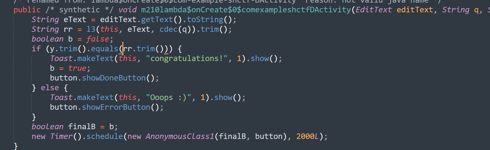
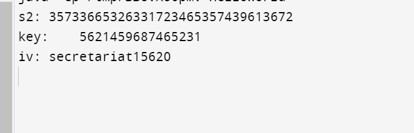

Input của chúng ta sau khi được xử lý bởi l3() sẽ được check với parameter y



Xác định y:

    * y là giá trị trả về từ l1(), base64 decode class name và function name được gọi bởi l1, dễ dàng xác định được hàm sẽ gọi gf() của class UT

    * Tại gf, open database và đọc row tại position = 0. Như vậy y là chuỗi 7mePfqpM6Wd1El2sj4dlUboU6PieF7La8IJ1e76cfp4=

Reverse l3:

    * Gọi function ech() của class DX


Đây là hàm AES encrypt cơ bản - input của chúng ta message sẽ được encrypt thành chuỗi sao cho thỏa mãn bằng y vậy y là cipher text, tìm key và IV để decrypt được input ban đầu.

```java
import java.nio.charset.StandardCharsets;
import java.util.Base64;
class HelloWorld {
   
    public static String cdec(String s) {
        StringBuilder htd = new StringBuilder();
        for (int i = 0; i < s.length() - 1; i += 2) {
            try {
                String output = s.substring(i, i + 2);
                int decimal = Integer.parseInt(output, 16);
                htd.append((char) decimal);
            } catch (Exception e) {
                e.printStackTrace();
                return "null";
            }
        }
        StringBuilder r = new StringBuilder();
        int keyItr = 0;
        for (int i2 = 0; i2 < htd.length(); i2++) {
            int temp = htd.charAt(i2) ^ "key".charAt(keyItr);
            r.append((char) temp);
            keyItr++;
            if (keyItr >= "key".length()) {
                keyItr = 0;
            }
        }
        return r.toString();
    }
   
    public static String gb(String s) {
        byte[] data = Base64.getDecoder().decode(s);
        return new String(data, StandardCharsets.UTF_8);
    }
    public static byte[] g(String hs) {
        if (hs.length() % 2 == 1) {
            throw new IllegalArgumentException("Invalid");
        }
        byte[] bytes = new byte[hs.length() / 2];
        for (int i = 0; i < hs.length(); i += 2) {
            bytes[i / 2] = hb(hs.substring(i, i + 2));
        }
        return bytes;
    }

    public static byte hb(String hs) {
        int firstDigit = td(hs.charAt(0));
        int secondDigit = td(hs.charAt(1));
        return (byte) ((firstDigit << 4) + secondDigit);
    }

    private static int td(char hc) {
        int digit = Character.digit(hc, 16);
        if (digit == -1) {
            throw new IllegalArgumentException("Invalid :" + hc);
        }
        return digit;
    }
    public static byte[] getK(int t, String s) {
        byte[] total = g(s);
        byte[] c = new byte[total.length / 2];
        if (t == 0) {
            for (int i = 0; i < total.length; i++) {
                if (i % 2 == 0) {
                    c[i / 2] = total[i];
                }
            }
        } else {
            for (int i2 = 0; i2 < total.length; i2++) {
                if (i2 % 2 == 1) {
                    c[i2 / 2] = total[i2];
                }
            }
        }
        return c;
    }
    public static void main(String[] args) {
        String s2 = cdec("58504e58564f5d504a59534a58544e59564d5d504a5e524d585c4f5a564f5c57");
        byte[] key = getK(0, s2 + gb("Mzg2OTM3NjEzNDc0MzYzMTM1MzUzMjM2MzMzMjMxMzA="));
        String keyStr = new String(key, StandardCharsets.UTF_8);
        byte[] iv = getK(1, s2 + gb("Mzg2OTM3NjEzNDc0MzYzMTM1MzUzMjM2MzMzMjMxMzA="));
        String ivStr = new String(iv, StandardCharsets.UTF_8);
        System.out.println("s2:\t" + s2);
        System.out.println("key:\t" + keyStr);
        System.out.println("iv:\t" +  ivStr);
    }
}
```

Sau khi tìm được IV và key:


