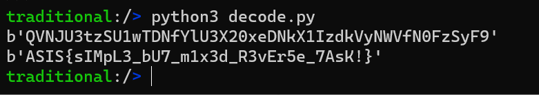

Flow của chương trình:

    * Nội dung trong file flag.txt sẽ được đọc và encode base64 

    * Nối b64encodedFlag với s1 = “This is the flag: ”, và s2= “ Just decode it :P” để tạo thành s = s1 + b64encodedFlag + s2

    * Sau đó encode s bằng hàm tạm gọi là blackbox function (ở đây, nhìn pseudo code khá rối nên mình không xác định được thuật toán encode), được encodedStr

    * encodedStr sẽ được thực hiện base64decode trước khi ghi mảng byte kết quả vào file flag.enc

Mục tiêu của mình là xác định được blackbox function.

Tại đây, mình có thể cheat bằng cách thay thế s bằng alphabet của base64 trước khi đi qua hàm blackbox function và check string trả về từ hàm này, mình nhận ra:

    * Ký tự lower sẽ được shift left 19

    * Ký tự upper sẽ được shift left 14

    * Ký tự số sẽ được shift left 5

```python
lower = list(b'abcdefghijklmnopqrstuvwxyz')
shift19_lower = list(b'tuvwxyzabcdefghijklmnopqrs')

upper           =   list(b'ABCDEFGHIJKLMNOPQRSTUVWXYZ')
shift14_upper   =   list(b'OPQRSTUVWXYZABCDEFGHIJKLMN')

num= list(b'0123456789')
shift5_num  = list(b'5678901234')


cip = list(b'4TrGsT5ByJKBrJdwsW6LdBRxq57L8IeMyBRHp6IGsm8IXBJE')
import string
a = [0 for i in range(len(cip))]

for i in range(len(cip)):
    if cip[i] < (65  + 26) and cip[i] >= 65:
        ind = shift14_upper.index(cip[i])
        a[i]= upper[ind]
    elif cip[i] < 58 and cip[i] >= 48:
        ind = shift5_num.index(cip[i])
        a[i]= num[ind]
    elif cip[i] < (97  + 26) and cip[i] >= 97:
        ind = shift19_lower.index(cip[i])
        a[i]= lower[ind]
    else:
        print("error")


# print(a)
import base64
a1 = bytes(a)[::-1]
# print(a1)
print(base64.b64decode(a1))
```

